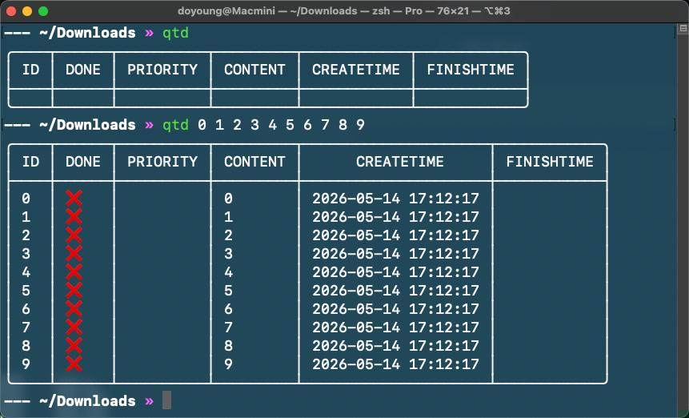

# QuickTodo

中文 | [English](README.en.md)

QuickTodo 是一个使用 Go 编写的终端 Todo CLI，用于快速管理本地待办事项。

默认可执行文件名为 `qtd`。

## 使用

```text
Usage: QuickTodo [options] [command] [todo...]

QuickTodo 是一个用于快速管理本地待办事项的终端 Todo CLI。支持添加、查看、修改、完成、删除和清空待办事项，并提供本地配置管理能力。

Arguments:
  todo  待办项

Options:
  -h, --help     display help for command
  -V, --version  output the version number

Commands:
  add [options] <todo...>       添加 待办项
  rm <index...>                 删除 待办项
  mod [options] <index> [todo]  修改 待办项
  list [options]                显示 待办项
  done <index...>               完成 待办项，等价于：mod <index> -d
  clear [options]               清空 待办项
  conf                          配置
```

示例：

```sh
./qtd add "write README"
./qtd list
./qtd mod 0 "update README"
./qtd done 0
```

根命令没有参数时等价于 `list`；直接传入文本时等价于 `add`。


